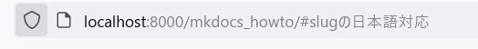

# MkDocsHowTo


## docstring example
moduleを指定すれば自動でdocstringとソースコードが表示できる

::: src.dummy


## darkmodeの切り替え
下の設定でできる

    theme:
    palette:
        - scheme: default
          toggle:
              icon: material/toggle-switch-off-outline
              name: ダークモードに切り替えます。
        - scheme: slate
          primary: red
          accent: red
          toggle:
              icon: material/toggle-switch
              name: ライトモードに切り替えます


## 注の書き方
```
test[^1] 


[^1]:注は一番したに表示されるよ
```
## 注釈
注釈を設定すると、ページ最下部にその内容が展開されます。

脚注への参照[^1]を書くことができます。

長い脚注は[^longnote]のように書くことができます。


[^1]: 1つめの脚注への参照です。


[^longnote]: 脚注を複数ブロックで書く例です。

    後続の段落はインデントされて、前の脚注に属します。


## リンクを新しいタブにしたい

* [mkdocs-open-in-new-tab](https://github.com/JakubAndrysek/mkdocs-open-in-new-tab)をisntallして
mkdocs.ymlを書き換え
``` yaml

plugins:
  - search
  - mkdocstrings
  - open-in-new-tab
```


* markdownを書き換えればできるが毎回書くのはめんどうなので

https://github.com/mkdocs/mkdocs/issues/1958


## 番号付け
mkdocs.ymlで指定したmdファイルが番号付けされる
``` yaml

nav:
  - Home: index.md
  - About: about.md
  - 技術日記: diary.md
  - mkdocs-memo: mkdocs_howto.md
  - IT: 
      django: IT/python/django/tips.md
```

https://github.com/timvink/mkdocs-enumerate-headings-plugin
## mkdocs plugin
[プラグイン集1(class-method)](https://dev.classmethod.jp/articles/mkdocs-plugins-1/#toc-1)


## 最終更新日を表示したい
ドキュメントの鮮度がわかるように日付をいれたほうがいいと推奨されている.
gitでの更新日が使われるよう
[mkdocs-git-revision-date-localized-plugin](https://github.com/timvink/mkdocs-git-revision-date-localized-plugin)を使おう


## slugの日本語対応
デフォルトで↓みたいにかくと日本語のリンクは数字で起き抱えられてしまうが、次の設定をしてやれば
リンク先に日本語も含められる。


[pymdown-extensionsのFAQ](https://facelessuser.github.io/pymdown-extensions/faq/#function-references-in-yaml)
```
## slugの日本語対応

[pymdown-extensionsのFAQ](https://facelessuser.github.io/pymdown-extensions/faq/#function-references-in-yaml)
```



```
 - markdown.extensions.toc:
        slugify: !!python/object/apply:pymdownx.slugs.slugify {kwds: {case: lower}}
        permalink: "\ue157"

```